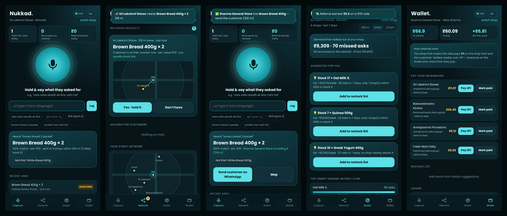
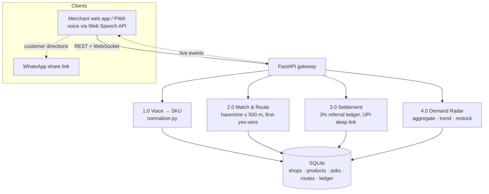
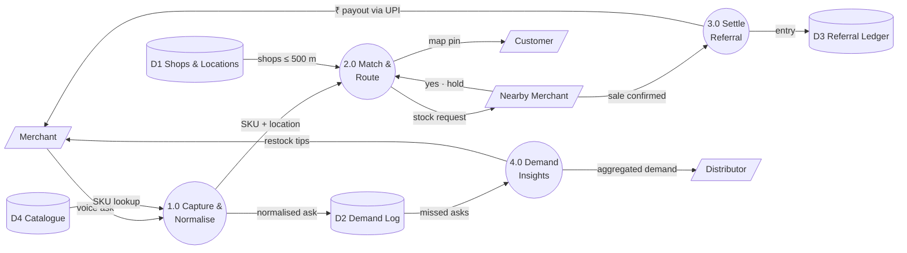

# Nukkad — every “nahi hai” becomes a sale

> HackSprint 2026 · Problem statement: *Small merchants of India*
> Team **Cache Me Outside** — Kevin Jason Agera (lead), Pavan Prabhu, Akshath Baruah, Niyathi G



## The problem
When a customer asks a kirana for something it doesn’t stock, the shopkeeper says *“nahi hai”* and the sale walks out, usually to a quick-commerce app. Nobody records it, so the item stays off the shelf and the next customer leaves too. POS systems, khata apps and UPI analytics only see **sales that happened**. The demand a shop *couldn’t* meet is invisible.

## The solution
Nukkad is a voice-first app that turns a street of competing kiranas into one big store.

| | Feature | What it does |
|---|---|---|
| 01 | **Capture: voice “nahi hai” log** | Hold one button and say what the customer asked for in English, Hindi or Kannada. The app matches it to a catalogue product (“oats wala doodh ek litre” → *Oat Milk 1L × 1*). No typing needed. |
| 02 | **Connect: Nukkad Network** | The request instantly reaches every shop within 500 m. The first shop to tap **Yes** holds the item. The asking shop gets a map pin and a WhatsApp message to send the customer. |
| 03 | **Settle: 3% referral** | The shop that makes the sale pays 3% to the shop that sent the customer. The ledger nets out per neighbour and can be paid with a UPI deep link. |
| 04 | **Discover: Demand Radar** | Adds up missed asks across the locality. It shows what people want that nobody stocks, what that is worth in ₹, the trend against last week, and a suggested restock quantity. |

## Quick start (about 2 minutes)
Requirements: **Python 3.10+**. For voice input, use **Chrome or Edge** (Web Speech API).

```bash
git clone https://github.com/<your-username>/nukkad.git
cd nukkad
./run.sh            # Windows: run.bat
```
Open **http://localhost:8000**.

<details><summary>Manual setup</summary>

```bash
python3 -m venv .venv && source .venv/bin/activate   # Windows: .venv\Scripts\activate
pip install -r requirements.txt
NUKKAD_RESET=1 uvicorn backend.main:app --reload     # Windows (PowerShell): $env:NUKKAD_RESET=1; uvicorn backend.main:app --reload
```
`NUKKAD_RESET=1` reseeds the demo database with 6 shops and 2 weeks of demand history. Leave it out to keep your data between runs.
</details>

### 60-second demo script
1. Open `http://localhost:8000/?shop=1` (**Sri Lakshmi Stores**) in one tab and `http://localhost:8000/?shop=2` (**Sharma General Store**) in another, side by side.
2. In Sri Lakshmi, **hold the mic** (or the Space bar) and say *“brown bread two packet”*. You can also type it or tap a demo chip.
3. Sharma’s **Network** tab gets a live request with a beep and a map. Tap **Yes · hold it**.
4. Sri Lakshmi instantly sees *“Sharma General Store is holding it, 218 m”* and a **Send customer on WhatsApp** button.
5. Sharma taps **Mark sold**. A ₹3.30 referral lands in Sri Lakshmi’s stats, and Sharma’s **Wallet** shows the payout with a UPI link.
6. Open **Radar** to see the week’s unmet demand around the shop and the restock suggestions.

Try other languages: switch the language chip to **हिंदी** or **ಕನ್ನಡ** and say *“मैगी मसाला दो”* or *“ಗ್ರೀಕ್ ಮೊಸರು ಇಲ್ಲ”*.

## Architecture


### Data flow (Level 1)


## Project structure
```
nukkad/
├── backend/
│   ├── main.py         # FastAPI app: REST API, WebSocket hub, serves the frontend
│   ├── services.py     # capture → route → settle → radar (DFD processes 1.0–4.0)
│   ├── normalizer.py   # multilingual speech/text → product + quantity (fuzzy matching)
│   ├── db.py           # SQLite schema, helpers, seed + synthetic demand history
│   └── seed_data.py    # demo shops, catalogue with EN/HI/KN aliases, inventory
├── frontend/           # vanilla JS PWA, no build step
│   ├── index.html · app.js · styles.css · manifest.webmanifest
├── tests/test_api.py   # pytest: normaliser + end-to-end flow + radar
├── docs/screenshots/
├── run.sh · run.bat · Dockerfile · requirements.txt
```

## API
Interactive docs are at **http://localhost:8000/docs** once the server is running.

| Method | Endpoint | Purpose |
|---|---|---|
| POST | `/api/asks` | Log a missed ask `{shop_id, text}` → normalise + route to nearby shops |
| POST | `/api/asks/{id}/correct` | Fix a wrong product match and re-route |
| POST | `/api/asks/{id}/respond` | Nearby shop answers `{shop_id, has_it}` (first yes wins) |
| POST | `/api/asks/{id}/sold` | Confirm the sale → create a 3% referral ledger entry |
| GET | `/api/shops/{id}/incoming` | Open requests for this shop |
| GET | `/api/shops/{id}/holding` | Items this shop is holding for referred customers |
| GET | `/api/shops/{id}/radar?radius_m=1000&days=7` | Unmet demand, trends, restock suggestions |
| GET | `/api/shops/{id}/wallet` | Referral balances, per-neighbour payouts, ledger |
| POST | `/api/shops/{id}/settle` | Mark referrals to a neighbour as paid |
| POST | `/api/normalize` | Debug: see how a phrase is understood |
| WS | `/ws/{shop_id}` | Live events: `incoming_request`, `ask_update`, `request_closed`, `ledger` |

## Tests
```bash
pytest -q
```

## Prototype vs. production
| Area | This prototype | Production plan |
|---|---|---|
| Speech-to-text | Browser Web Speech API (en-IN, hi-IN, kn-IN) | Bhashini / IndicWhisper (22 languages, works on low-end phones) |
| Understanding | Alias dictionary + fuzzy matching (RapidFuzz) | LLM + sentence embeddings over a full product catalogue |
| Geo search | Haversine in Python | PostgreSQL + PostGIS |
| Live updates | FastAPI WebSockets | + Redis pub/sub, FCM push notifications |
| Client | Responsive web app / PWA | Flutter Android app + WhatsApp bot |
| Payments | UPI deep links, manual “mark paid” | Payment gateway auto-settlement using UPI transaction references |
| Data | SQLite + synthetic history | Real pilot data (50 shops in one Bengaluru ward) |

All shops, UPI IDs and demand numbers in this repo are made up for the demo.

## License
MIT. See [LICENSE](LICENSE).
